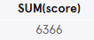
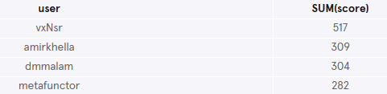
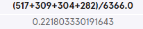
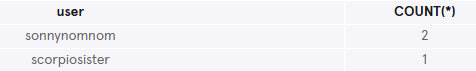
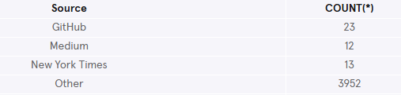
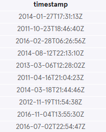
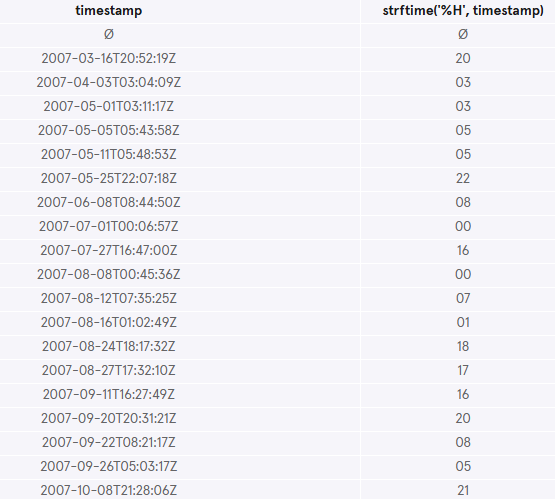
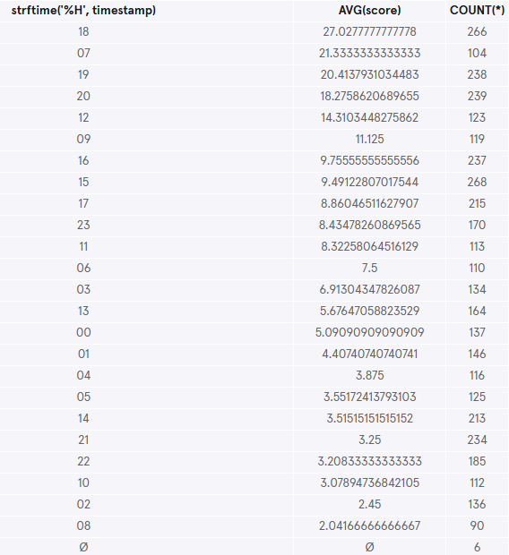
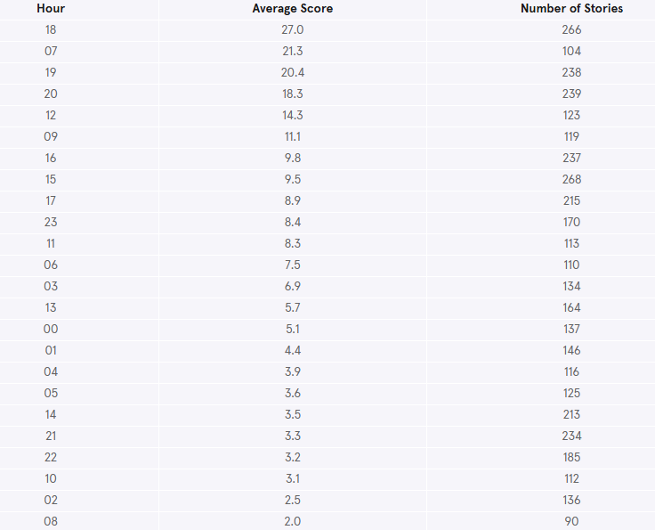

# Analyze Hacker News Trends
[Hacker News](https://news.ycombinator.com/) is a popular website run by Y Combinator. It's widely known by people in the tech industry as a community site for sharing news, showing off projects, asking questions, among other things.

In this project, you will be working with a table named `hacker_news` that contains stories from Hacker News since its launch in 2007. It has the following columns:
- `title` -  the title of the story
- `user` - the user who submitted the story
- `score` - the score of the story
- `timestamp` - the time of the story
- `url` - the link of the story  

## Understanding the dataset
### 1. Find the most popular Hacker News stories
Start by getting a feel for the hacker_news table!

Let's find the most popular Hacker News stories:
What are the top five stories with the highest scores?

```sql
SELECT title, score
FROM hacker_news
ORDER BY score DESC
LIMIT 5;
```


## Hacker News Moderating
### 2. Find the total score of all stories
Recent studies have found that online forums tend to be dominated by a small percentage of their users ([1-9-90 Rule](https://en.wikipedia.org/wiki/1%25_rule)).

Is this true of Hacker News?

Is a small percentage of Hacker News submitters taking the majority of the points?

First, find the total score of all the stories.
```sql
SELECT SUM(score)
FROM hacker_news;
```


### 3. Find users with combined scores of more than 200
Next, we need to pinpoint the users who have accumulated a lot of points across their stories.

Find the individual users who have gotten combined scores of more than 200, and their combined scores.
```sql
SELECT user, SUM(score)
FROM hacker_news
GROUP BY user
HAVING SUM(score) > 200
ORDER BY 2 DESC;
```


### 4. Is Hacker News dominated by a small percentage of users?
Then, we want to add these users' scores together and divide by the total to get the percentage.

Add their scores together and divide it by the total sum. 
```sql
SELECT (517+309+304+282)/6366.0;
```


**So, is Hacker News dominated by these users?**

These 4 users have a combined 22% of the total scores in the table.

### 5. Rickrolling users
Oh no! While we are looking at the power users, some users are rickrolling — tricking readers into clicking on a link to a funny video and claiming that it links to information about coding.

The url of the video is:
https://www.youtube.com/watch?v=dQw4w9WgXcQ

How many times has each offending user posted this link?
```sql
SELECT user, COUNT(*) 
FROM hacker_news 
WHERE url LIKE '%watch?v=dQw4w9WgXcQ%'
GROUP BY 1 
ORDER BY 2 DESC;
```


## Which sites feed Hacker News?
### 6. Categorise stories based on source
Hacker News stories are essentially links that take users to other websites.

Which of these sites feed Hacker News the most: GitHub, Medium, or New York Times?

First, we want to categorise each story based on their source.
```sql
SELECT CASE
   WHEN url LIKE '%github.com%' THEN 'GitHub'
   WHEN url LIKE '%medium.com%' THEN 'Medium'
   WHEN url LIKE '%nytimes.com%' THEN 'New York Times'
   ELSE 'Other'
  END AS 'Source'
FROM hacker_news;
```

### 7. Which site feed Hacker News the most?
Next, build on the previous query: Add a column for the number of stories from each URL and group by the case statement.
```sql
SELECT CASE
   WHEN url LIKE '%github.com%' THEN 'GitHub'
   WHEN url LIKE '%medium.com%' THEN 'Medium'
   WHEN url LIKE '%nytimes.com%' THEN 'New York Times'
   ELSE 'Other'
  END AS 'Source',
  COUNT(*)
FROM hacker_news
GROUP BY 1;
```


## What's the best time to post a story?
### 8. Timestamp column
Every submitter wants their story to get a high score so that the story makes it to the front page, but…

What's the best time of the day to post a story on Hacker News?

Before we get started, let's take a look at the timestamp column:
```sql
SELECT timestamp
FROM hacker_news
LIMIT 10;
```


Notice that the values are formatted like: `2018-05-08T12:30:00Z`

If you ignore the T and Z, the format is: `YYYY-MM-DD HH:MM:SS`

### 9. Strftime function
SQLite comes with a strftime() function - a very powerful function that allows you to return a formatted date. It takes two arguments: `strftime(format, column)`

Let's test this function out: 
```sql
SELECT timestamp,
   strftime('%H', timestamp)
FROM hacker_news
GROUP BY 1
LIMIT 20;
```


This returns the hour, HH, of the timestamp column!

### 10. Apply function 
Okay, now we understand how `strftime()` works. Let's write a query that returns three columns:
- The hours of the timestamp
- The average score for each hour
- The count of stories for each hour

```sql
SELECT strftime('%H', timestamp), 
   AVG(score),
   COUNT(*)
FROM hacker_news
GROUP BY 1
ORDER BY 2 DESC;
```


### 11. Improve the last query
Let's edit a few things in the previous query:
- Round the average scores
- Rename the columns to make it more readable
- Filter out null values in the timestamp

What are the best hours to post a story on Hacker News?
```sql
SELECT strftime('%H', timestamp) AS 'Hour', 
   ROUND(AVG(score), 1) AS 'Average Score', 
   COUNT(*) AS 'Number of Stories'
FROM hacker_news
WHERE timestamp IS NOT NULL
GROUP BY 1
ORDER BY 2 DESC;
```
