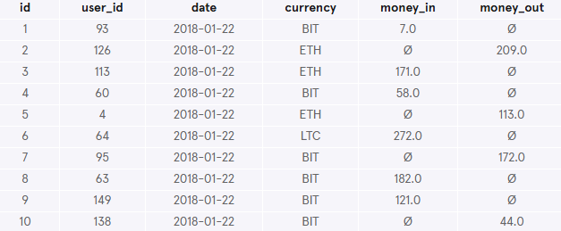
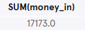
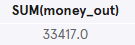
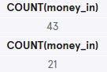
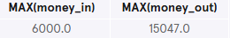
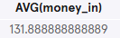
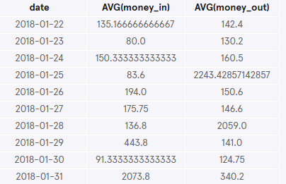
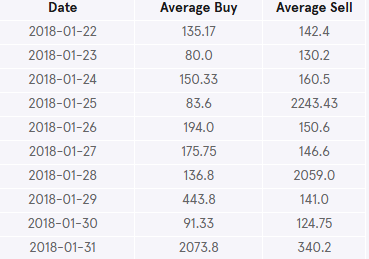

# Cryptocurrency Exchange
Fiddy Cent is a digital currency exchange headquartered in Neo Tokyo. They broker exchanges of Bitcoin, Bitcoin Cash, Ethereum, and Litecoin with fiat currencies in around 50 countries.

Help them analyze their January ledger data using SQL aggregate functions! You are given the `transactions` table, which contains both money-in and money-out transactions.

### 1. What are the column names?
Let's start by checking out the transactions table:
```sql
SELECT *
FROM transactions
LIMIT 10;
```

The column names are id, user_id, date, currency, money_in and money_out.

### 2. What is the total money_in in the table?
The money_in column records the amount (in USD) the user bought.
```sql
SELECT SUM(money_in)
FROM transactions;
```


### 3. What is the total money_out in the table?
The money_out column records the amount (in USD) the user sold.
```sql
SELECT SUM(money_out)
FROM transactions;
```


### 4. Does Bitcoin dominate the exchange?
It was reported that Bitcoin dominates Fiddy Cent's exchange. Let's see if it is true within these dates by answering two questions:
- How many money_in transactions are in this table?
- How many money_in transactions are in this table where 'BIT' is the currency?
```sql
SELECT COUNT(money_in)
FROM transactions;

SELECT COUNT(money_in)
FROM transactions
WHERE currency = 'BIT';
```
  
Out of 43 different money_in transactions, 21 of them are with Bitcoin!

### 5. What was the largest transaction in this whole table?
Was it money_in or money_out?
```sql
SELECT MAX(money_in), MAX(money_out)
FROM transactions;
```
  
The largest transaction was a substantial money_out transaction of $15,047 USD!

### 6. What is the average money_in for Ethereum?
What is the average money_in in the table for the currency Ethereum ('ETH')?
```sql
SELECT AVG(money_in)
FROM transactions
WHERE currency = 'ETH';
```
  

### 7. Let's build a ledger for the different dates
Select date, average money_in, and average money_out from the table. And group everything by date.
```sql
SELECT date, AVG(money_in), AVG(money_out)
FROM transactions
GROUP BY date;
```
  

### 8. Improve previous query
 To make the previous query easier to read:
 - Round the averages to 2 decimal places.
 - Give the column aliases using AS for readability.
```sql
SELECT date AS 'Date', 
   ROUND(AVG(money_in), 2) AS 'Average Buy',
   ROUND(AVG(money_out), 2) AS 'Average Sell'
FROM transactions
GROUP BY date;
```
