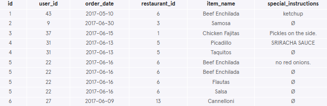
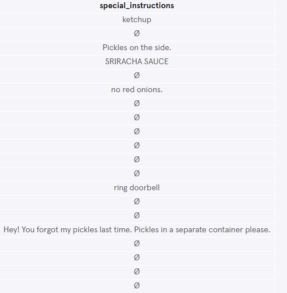
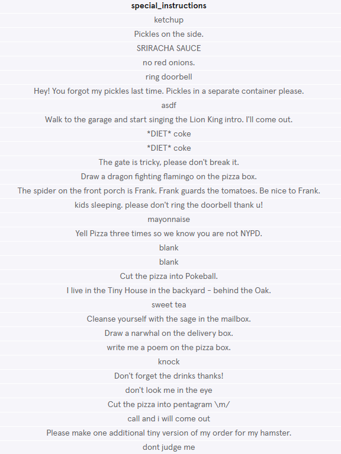
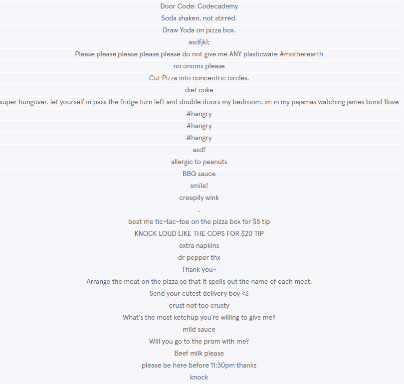
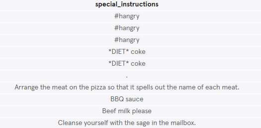
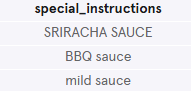
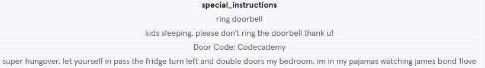
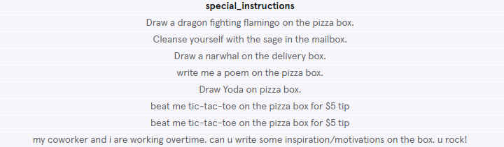
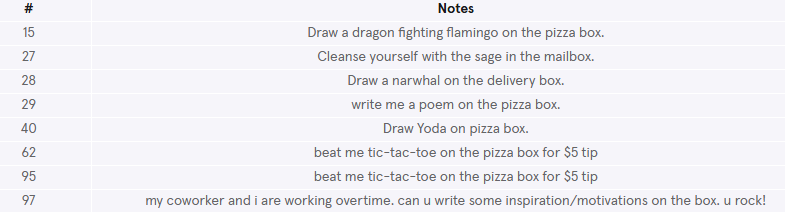
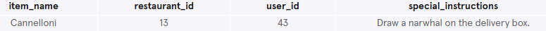

# Davie's Burgers Subway Ad
Davie's Burgers: The Sequel

Do you remember Davie's Burgers from our Learn CSS course? Well, the restaurant business has been booming and it is now looking to place a catchy advertisement in the local subway station.

Help them dig into their orders table to see if there is anything interesting in there for a funny tagline!


## Write the following queries:
### 1. What are the column names?
Start by getting a feel for the orders table:
```sql
SELECT *
FROM orders
LIMIT 10;
```

The column names are `id`, `user_id`, `order_date`, `restaurant_id`, `item_name` and `special_instructions`.

### 2. How recent is this data?
Find out all the unique order_date values in this table.
```sql
SELECT DISTINCT order_date
FROM orders
ORDER BY order_date DESC;
```


The data is from May and June 2017.

### 3. Inspect special instructions
The special_instructions column stores the data where Davie's Burgers customers leave a note for the kitchen or the delivery.

Write a query that selects only the special_instructions column. Limit the result to 20 rows.
```sql
SELECT special_instructions
FROM orders
LIMIT 20;
```


### 4. Only return instructions that are not empty
There seem to be a lot of empty values in that column. That is because customers sometimes leave the notes section blank.

Can you edit the query so that we are only returning the special instructions that are not empty?
```sql
SELECT special_instructions
FROM orders
WHERE special_instructions IS NOT NULL;
```




### 5. Sort instructions alphabetically
Let's go even further and sort the instructions in alphabetical order (A-Z).

```sql
SELECT special_instructions
FROM orders
WHERE special_instructions IS NOT NULL
ORDER BY special_instructions
LIMIT 10;
```


### 6. Find the word 'sauce' in special instructions
Awesome! Now we have a good idea of the list.

Let's search for special instructions that have the word 'sauce'.

Are there any funny or interesting ones?
```sql
SELECT special_instructions
FROM orders
WHERE special_instructions LIKE '%sauce%';
```


### 7. Find the word 'door' in special instructions
Let's search for special instructions that have the word 'door'.

Any funny or interesting ones?
```sql
SELECT special_instructions
FROM orders
WHERE special_instructions LIKE '%door%';
```


### 8. Find the word 'box' in special instructions
Let’s search for special instructions that have the word 'box'.

Any funny or interesting ones?
```sql
SELECT special_instructions
FROM orders
WHERE special_instructions LIKE '%box%';
```


### 9. Find the order numbers
Wow, some of these are marketing gold! But what are their order numbers?

Instead of just returning the special instructions, also return their order ids.

For more readability:
- Rename `id` as `#`
- Rename `special_instructions` as `Notes`

```sql
SELECT id AS '#',
   special_instructions AS 'Notes'
FROM orders
WHERE special_instructions LIKE '%box%';
```


### 10. Challenge
Great work! You have found special instructions that are funny and ridiculous - the perfect combo for a Davie’s Burgers tagline.

The marketing agency took it from there and worked out a [subway ad](https://static-assets.codecademy.com/content/codecademy-content-sites/learn-sql-orders-project/index.html) in no time!

They have asked you to query the customer who made the phrase. Return the `item_name`, `restaurant_id`, `user_id` and `special_instructions` for the person that created the phrase.
```sql
SELECT item_name, restaurant_id, user_id, special_instructions
FROM orders
WHERE special_instructions LIKE '%narwhal%';
```
