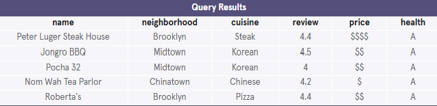
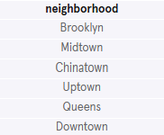
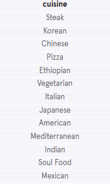
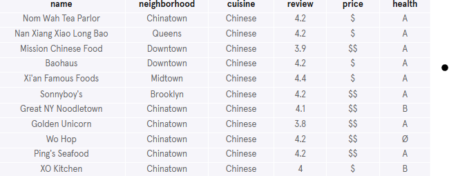
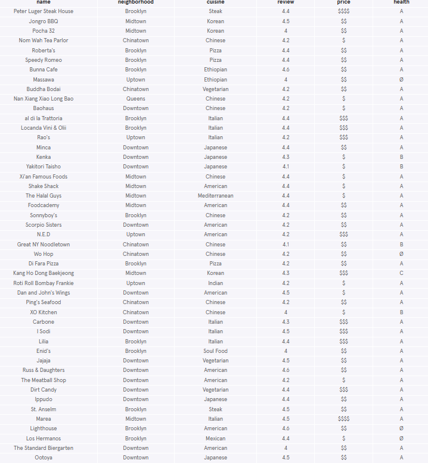
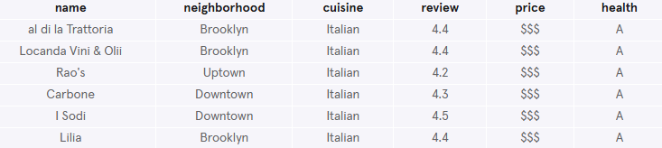
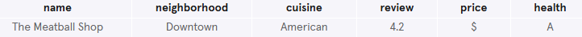
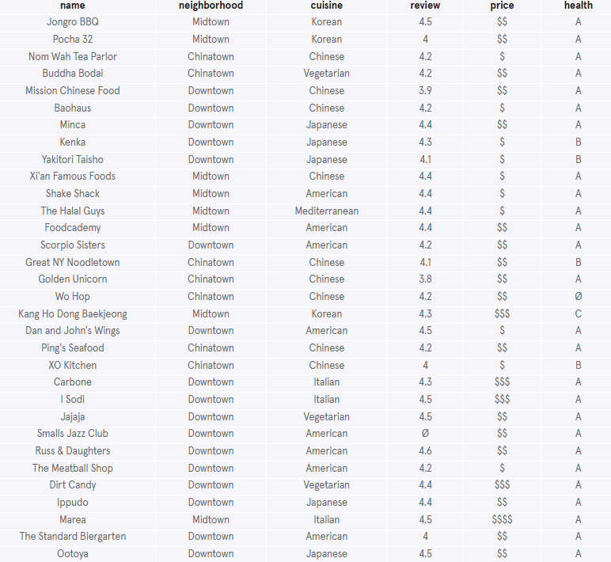
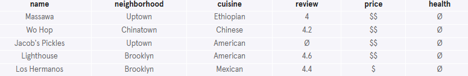
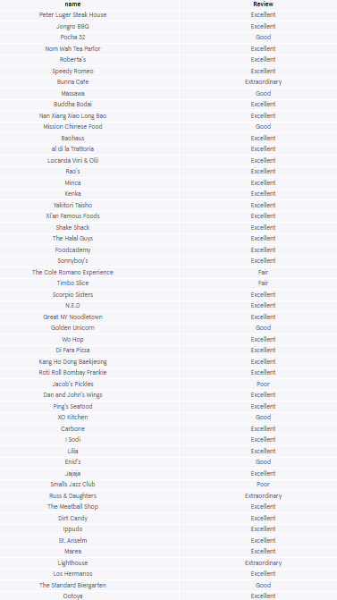

# New York Restaurants
We have put together a table of restaurants called nomnom and we need your help to answer some questions. Use the SQL commands you just learned and find the best dinner spots in the city.

The schema of this table is shown below:


### 1. Start by getting a feel for the nomnom table:
```sql
SELECT *
FROM nomnom
LIMIT 5;
```


The column names are: `name`, `neighborhood`, `cuisine`, `review`, `price` and `health`.

### 2. What are the distinct neighborhoods?
```sql
SELECT DISTINCT neighborhood
FROM nomnom;
```


### 3. What are the distinct cuisine types?
```sql
SELECT DISTINCT cuisine
FROM nomnom;
```


### 4. Suppose we would like some Chinese takeout. What are our options?
```sql
SELECT *
FROM nomnom
WHERE cuisine = 'Chinese';
```


### 5. Return all the restaurants with reviews of 4 and above.
```sql
SELECT *
FROM nomnom
WHERE review >= 4;
```


### 6. Suppose Abbi and Ilana want to have a fancy dinner date.
Return all the restaurants that are Italian and $$$.
```sql
SELECT *
FROM nomnom
WHERE cuisine = 'Italian' AND price = '$$$';
```


### 7. Your coworker Trey can't remember the exact name of a restaurant he went to but he knows it contains the word 'meatball' in it.
Can you find it for him using a query?
```sql
SELECT *
FROM nomnom
WHERE name LIKE '%meatball%';
```


### 8. Let's order delivery to the house!
Find all the close by spots in Midtown, Downtown or Chinatown.
```sql
SELECT *
FROM nomnom
WHERE neighborhood = 'Midtown' 
   OR neighborhood = 'Downtown' 
   OR neighborhood = 'Chinatown';
```


### 9. Find all the health grade pending restaurants
```sql
SELECT *
FROM nomnom
WHERE health IS NULL;
```


### 10. Create a Top 10 Restaurants Ranking based on reviews.
```sql
SELECT *
FROM nomnom
ORDER BY review DESC
LIMIT 10;
```


### 11. Use a CASE statement to change the rating system
Set the following:
- review > 4.5 is Extraordinary
- review > 4 is Excellent
- review > 3 is Good
- review > 2 is Fair
- Everything else is Poor
- Remember to rename the new column

```sql
SELECT name,
 CASE
  WHEN review > 4.5 THEN 'Extraordinary'
  WHEN review > 4 THEN 'Excellent'
  WHEN review > 3 THEN 'Good'
  WHEN review > 2 THEN 'Fair'
  ELSE 'Poor'
 END AS 'Review'
FROM nomnom;
```
