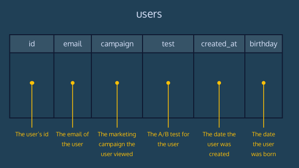
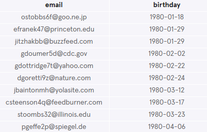
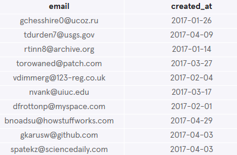
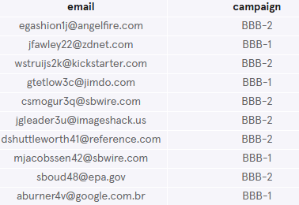
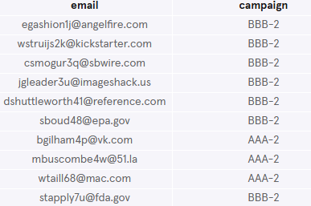
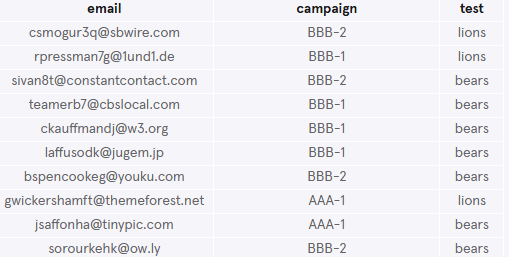
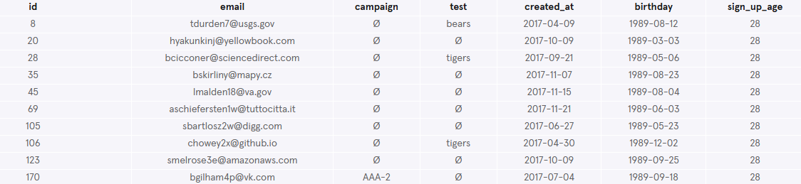

# RPA Customer Segmentation
The marketing department of Reputable Product Agency (RPA) is looking to segment the company users by a number of different criteria.

In this context, a segment is a subset of users that meet different conditions. Segments are used to send marketing campaigns to users who meet specific criteria or to measure the performance of specific marketing campaigns.

Use SQL queries to generate user lists for the marketing department. The users dataset is imported into the workspace

Database schema can be seen below:



## Write the following queries:
### 1. What are the column names?
Start by getting a feel for the users table:
```sql
SELECT *
FROM users
LIMIT 20;
```


**What are the column names?**

The column names are: `id`, `email`, `campaign`, `test`, `created_at` and `birthday`.

### 2. Find emails of poeple born in the 80s
The marketing department wants to send a Born in the '80s email to the appropriate users.

Find the email addresses and birthdays of users whose birthday is between 1980-01-01 and 1989-12-31. Notice the birthday column is a text column.
```sql
SELECT email, birthday
FROM users
WHERE birthday BETWEEN '1980-01-01' AND '1989-12-31'
ORDER BY birthday
LIMIT 10;   
```
Alternatively this also works:
```sql
SELECT email, birthday
FROM users
WHERE birthday >= '1980-01-01' AND birthday <= '1989-12-31';
LIMIT 10;   
```


### 3. Find users who signed up before May 2017
We are interested in the group of users that signed up prior to May 2017.

Find the emails and creation date of users whose created_at date matches this condition.
```sql
SELECT email, created_at
FROM users
WHERE created_at <= '2017-04-30'
LIMIT 10;
```


### 4. Find users that were shown a specific test
There was an A/B test performed on users that used cute animal clipart to encourage users to sign up. We'd like to see how the group that was shown 'bears' is performing.

Find the emails of the users who received the ‘bears’ test.
```sql
SELECT email
FROM users
WHERE test = 'bears'
LIMIT 10;
```


### 5. Find emails of users who received a specific campaign
A total of 4 advertising campaigns were run over this period.

There were two sets of ad copy (set 1 and set 2) and both were run on two search engine sites (AAA and BBB). The resulting campaign values are:
- AAA-1
- AAA-2
- BBB-1
- BBB-2

Find the emails of users who received a campaign on website BBB.
```sql
SELECT email, campaign
FROM users
WHERE campaign LIKE 'BBB-%'
LIMIT 10;
```


### 6. Find emails of users who received a specific campaign
Find the emails of users who received ad copy 2 in their campaign.
```sql
SELECT email, campaign
FROM users
WHERE campaign LIKE '%-2'
LIMIT 10;
```


### 7. Find users who recieved both a campaign and a test
Find the emails for all users who received both a campaign and a test.
These users will have non-empty entries in the campaign and test columns.
```sql
SELECT email
FROM users
WHERE campaign IS NOT NULL 
  AND test IS NOT NULL
LIMIT 10;
```


### 7. Challenge
One of the members of the marketing team had an idea of calculating how old users were when they signed up. Look into created_at and birthday. Only take the year into account.
```sql
SELECT 
  *, 
  (SUBSTR(created_at, 1, 4) - SUBSTR(birthday, 1, 4)) AS sign_up_age
FROM 
  users
ORDER BY 
  sign_up_age
LIMIT 10;
```
