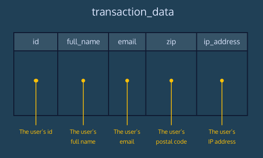
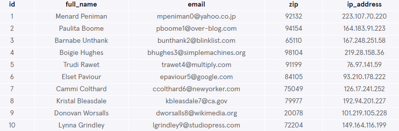
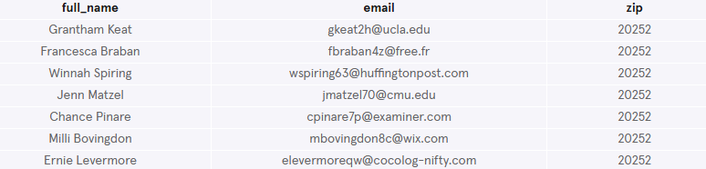
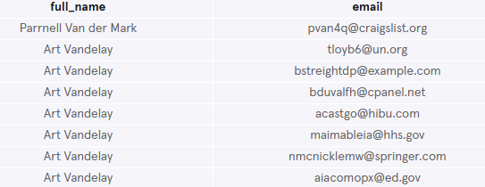
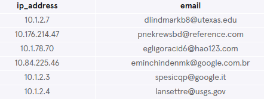
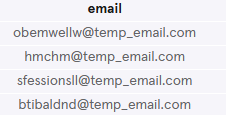
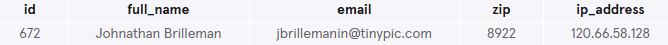
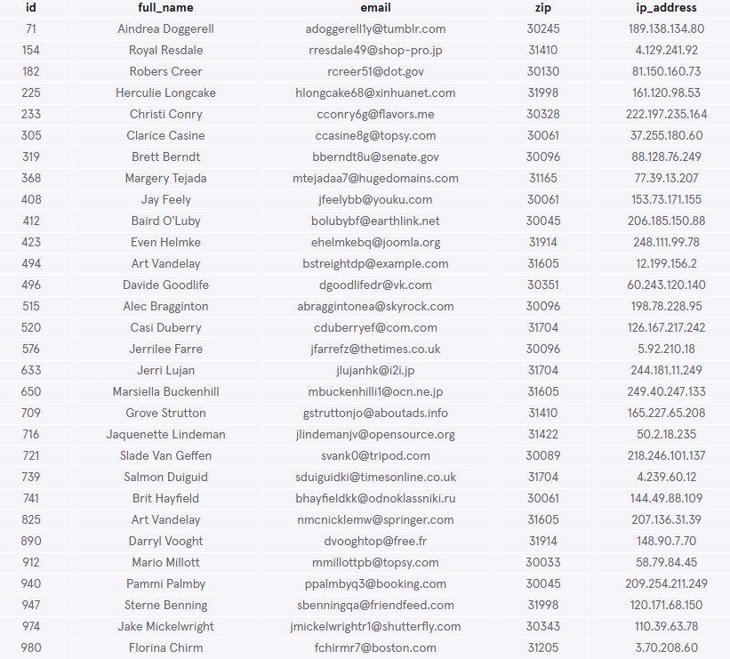

# RPA Fraud Detection
Reputable Product Agency (RPA) has started receiving complaints from their credit card processor about fraudulent transactions. Help your finance department identify potentially risky transactions before they finish processing.

This dataset contains a single table, transaction_data.

The schema of this table is shown below:



## Write the following queries:
### 1. What are the column names?
Start by getting a feel for the transaction_data table:
```sql
SELECT *
FROM transaction_data
LIMIT 10;
```


**What are the column names?**

The column names are `id`, `full_name`, `email`, `zip` and `ip_address`.

### 2. Find the full names and emails of the transactions listing zip as 20252
The finance department noted that some of the fraudulent transactions were recorded as coming from Smokey Bear's zip code (20252).

You agree this is suspicious, it's unlikely that the fire prevention mascot is using Reputable Company's services.

Find the full_names and emails of the transactions listing 20252 as the zip code.
```sql
SELECT full_name, email, zip
FROM transaction_data
WHERE zip = 20252;
```


### 3. Find names and emails associated with fraudsters
Finance has also noticed a number of pseudonyms associated with fraudulent transactions.

The fraudsters thought it would be funny to use ‘Art Vandelay’ for their full name or add a ‘der’ for their middle name.

Use a query to find the names and emails associated with these transactions.
```sql
SELECT full_name, email
FROM transaction_data
WHERE full_name = 'Art Vandelay'
   OR full_name LIKE '% der %';
```


### 4. Irregularities in IP adresses
There are some irregularities in the IP addresses where transactions are originating from.

For example, any IP address beginning with '10.' is reserved for internal use. We shouldn't see IP addresses like this accessing Reputable Company's service.

Find the ip_addresses and emails listed with these transactions.
```sql
SELECT ip_address, email
FROM transaction_data
WHERE ip_address  LIKE '10.%';
```


### 5. Find temporary emails
Users are making fraudulent transactions using a temporary email address service. These services provide a short-lived email that can be verified and then self-destructs.

Find the emails in transaction_data with ‘temp_email.com’ as a domain.
```sql
SELECT email
FROM transaction_data
WHERE email LIKE '%temp_email.com';
```


### 6. Find specific transaction
The finance department is looking for a specific transaction. They know that the transaction occurred from an ip address starting with '120.' and their full name starts with 'John'.

Can you find the transaction?
```sql
SELECT *
FROM transaction_data
WHERE full_name LIKE 'John%' 
  AND ip_address LIKE '120.%';
```


### 7. Challenge
Return only those customers residing in GA. Use the list of [ZIP CODE prefixes](https://en.wikipedia.org/wiki/List_of_ZIP_Code_prefixes) to determine the best query for zip codes belonging to Georgia(GA).
```sql
SELECT *
FROM transaction_data
WHERE zip LIKE '30%' 
   OR zip LIKE '31%' 
   OR zip LIKE '398%' 
   OR zip LIKE '399%';
```

