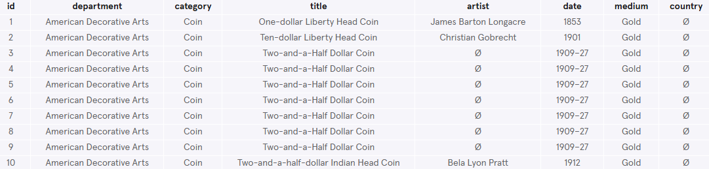
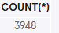
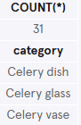
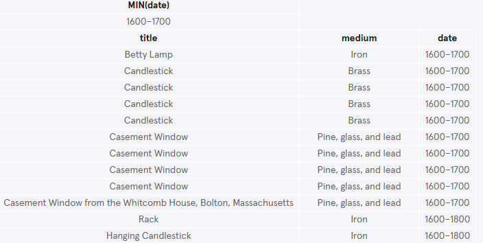
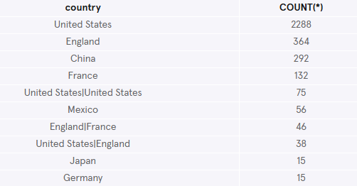
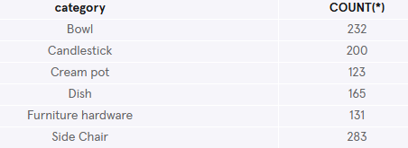
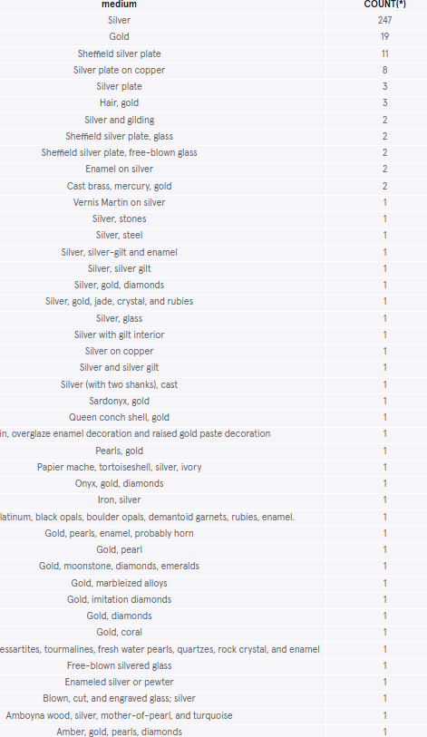

# The Metropolitan Museum of Art
[The Metropolitan Museum of Art](https://www.metmuseum.org/) of New York is one of the world's largest and finest art museums.

In this project, you will be working with a table named `met` that contains the museum's collection of American Decorative Arts.

This data was kindly made publicly available under the Open Access Policy.


## Pre-Gaming for Aggregates
### 1. Find column names
Start by getting a feel for the met table:
```sql
SELECT *
FROM met
LIMIT 10;
```


**What are the column names?**

It has the following columns:
- `id` - the id of the art piece
- `department` - the department of the art piece
- `category` - the category of the art piece
- `title` - the title name of the art piece
- `artist` - the name of the artist
- `date` - the date(s) of the art piece
- `medium` - the medium of the art piece
- `country` - the country of the artist

### 2. How many pieces are in the American Decorative Art collection?
```sql
SELECT COUNT(*)
FROM met;
```


### 3. Count the number of pieces in the category 'celery' 
Celery was considered a luxurious snack in the Victorian era (around the 1800s). Wealthy families served stalks of it in intricate [glass vases](https://www.metmuseum.org/art/collection/search/9310).

Don't believe it?

Count the number of pieces where the category includes 'celery'. And return the categories
```sql
SELECT COUNT(*)
FROM met
WHERE category LIKE '%celery%';

SELECT DISTINCT category
FROM met
WHERE category LIKE '%celery%';
```


### 4. Find the title and medium of the oldest piece(s) in the collection.
```sql
SELECT MIN(date)
FROM met;

SELECT title, medium, date
FROM met
WHERE date LIKE '%1600%';
```


### 5. Find origin of pieces in the collection
Not every American decoration is from the Americas… where are they are coming from?

Find the top 10 countries with the most pieces in the collection.
```sql
SELECT country, COUNT(*)
FROM met
WHERE country IS NOT NULL
GROUP BY 1
ORDER BY 2 DESC
LIMIT 10;
```


### 6. Find categories with more than 100 pieces.
There are all kinds of American decorative art in the Met's collection.

Find the categories with more than 100 pieces.
```sql
SELECT category, COUNT(*)
FROM met
GROUP BY 1
HAVING COUNT(*) > 100;
```


### 7. Gold and silver pieces
Lastly, let's look at some bling!

Count the number of pieces where the medium contains 'gold' or 'silver' and sort in descending order.
```sql
SELECT medium, COUNT(*)
FROM met
GROUP BY 1
HAVING medium LIKE '%gold%' OR medium LIKE '%silver%'
ORDER BY 2 DESC;
```


Let's clean those categories up:
```sql
SELECT CASE
   WHEN medium LIKE '%gold%'   THEN 'Gold'
   WHEN medium LIKE '%silver%' THEN 'Silver'
   ELSE NULL
  END AS 'material',
  COUNT(*) AS 'number of pieces'
FROM met
WHERE material IS NOT NULL
GROUP BY 1
ORDER BY 2 DESC;
```
