# Trends in Startups
Howdy! It’s your first day as a [TechCrunch](https://techcrunch.com/) reporter. Your first task is to write an article on the rising trends in the startup world.

To get you started with your research, your boss emailed you a project.sqlite file that contains a table called `startups`. It is a portfolio of some of the biggest names in the industry.

Write queries with aggregate functions to retrieve some interesting insights about these companies.

## Write the following queries:
### 1. What are the column names
Getting started, take a look at the startups table:
```sql
SELECT *
FROM startups
LIMIT 20;
```
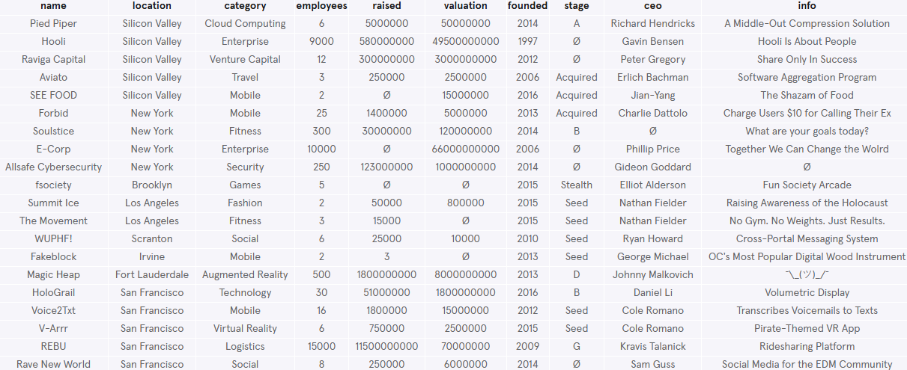

**How many columns are there?**

There are 10 columns: `name`, `location`, `category`, `employees`, `raised`, `valuation`, `founded`, `stage`, `ceo` and `info`.

### 2. Calculate the total number of companies in the table.
```sql
SELECT COUNT(*)
FROM startups;
```
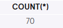

### 3. Calculate the total value of all companies
We want to know the total value of all companies in this table.
```sql
ELECT SUM(valuation)
FROM startups;
```
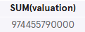

### 4. What is the highest amount raised by a startup?
Return the maximum amount of money raised.
```sql
SELECT MAX(raised)
FROM startups;
```
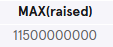

### 5. What is the maximum amount of seed money raised?
Edit the query so that it returns the maximum amount of money raised, during 'Seed' stage.
```sql
SELECT MAX(raised)
FROM startups
WHERE stage = 'Seed';
```
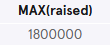

### 6. In what year was the oldest company on the list founded?
```sql
SELECT MIN(founded)
FROM startups;
```


## Let's find out the valuations among different sectors:
### 7. Return the average valuation.
```sql
SELECT AVG(valuation)
FROM startups;
```
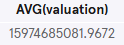

### 8. Return the average valuation, in each category.
```sql
SELECT category, AVG(valuation)
FROM startups
GROUP BY category;
```
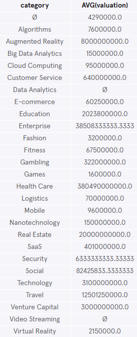

### 9. Return the average valuation, in each category.
Round the averages to two decimal places.
```sql
SELECT category, ROUND(AVG(valuation),2)
FROM startups
GROUP BY category;
```
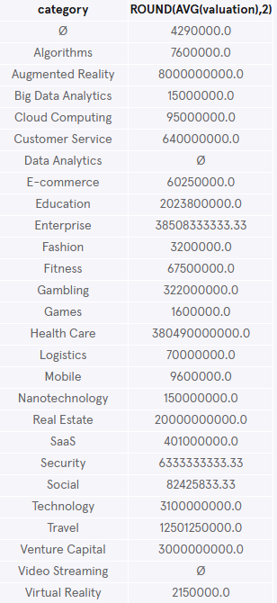

### 10. Return the average valuation, in each category.
Round the averages to two decimal places. Lastly, order the list from highest averages to lowest.
```sql
SELECT category, ROUND(AVG(valuation),2)
FROM startups
GROUP BY 1
ORDER BY 2 DESC;
```
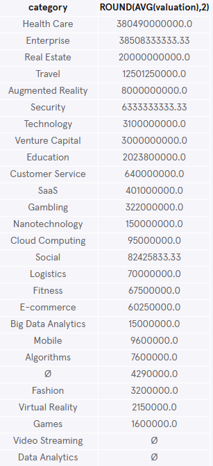

## What are the most competitive markets?
### 11. Calculate number of companies per category
First, return the name of each category with the total number of companies that belong to it.
```sql
SELECT category, COUNT(*)
FROM startups
GROUP BY 1;
```
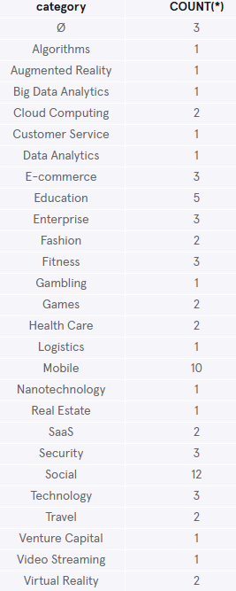

### 12. Filter previous query
Next, filter the result to only include categories that have more than three companies in them.
```sql
SELECT category, COUNT(*)
FROM startups
GROUP BY category
HAVING COUNT(*) > 3
ORDER BY 2 DESC;
```
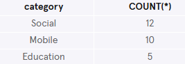

**What are the most competitive markets?**

The most competitive markets are: Social, Mobile and Education.

## Let's see if there's a difference in startups sizes among different locations:
### 13. What is the average size of a startup in each location?
```sql
SELECT location, AVG(employees)
FROM startups
GROUP BY location;
```
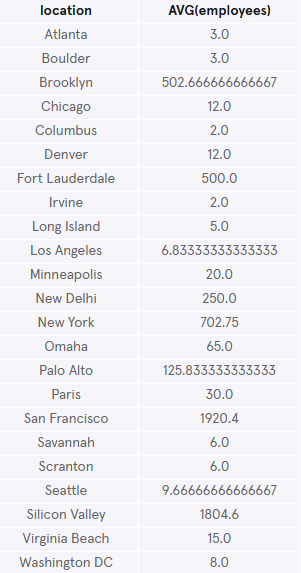

### 14. Filter previous query
What is the average size of a startup in each location, with average sizes above 500?
```sql
SELECT location, AVG(employees)
FROM startups
GROUP BY location
HAVING AVG(employees)> 500;
```
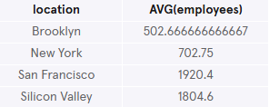
